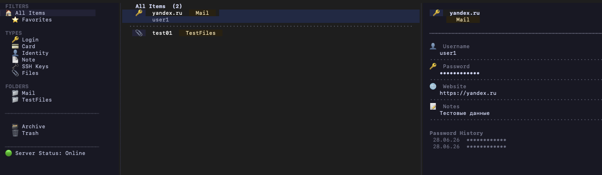

# GophKeeper

A secure, self-hosted password manager with a terminal UI (TUI), gRPC backend, and offline read-only support.

## Features

- **Terminal UI** — full-featured TUI built with Bubble Tea (Catppuccin Mocha theme)
- **Item types** — Logins, Cards, Identities, Notes, SSH Keys, Files, TOTP Authenticators
- **End-to-end encryption** — ChaCha20-Poly1305; server never sees plaintext
- **TOTP MFA** — optional per-account two-factor authentication
- **Password generator** — random and deterministic (site-specific) modes
- **Passphrase generator** — wordlist-based, configurable word count
- **Offline mode** — read-only access from local encrypted cache when server is unavailable
- **Real-time sync** — gRPC streaming keeps multiple clients in sync instantly
- **Audit log** — every auth and vault operation is recorded with user, IP, and detail
- **CLI** — `credential` commands for scripting and clipboard copy

---

## Architecture

```
┌─────────────────────────────────┐
│  Client (./gophkeeper)          │
│  ┌──────────┐  ┌─────────────┐  │
│  │  TUI     │  │  CLI cmds   │  │
│  └────┬─────┘  └──────┬──────┘  │
│       └────────┬───────┘        │
│          gRPC + TLS             │
└──────────────────┬──────────────┘
                   │
┌──────────────────▼──────────────┐
│  Server                         │
│  Auth · Vault · Sync · MFA      │
│  Rate limiting · Audit log      │
└──────────────────┬──────────────┘
                   │
┌──────────────────▼──────────────┐
│  PostgreSQL                     │
│  users · vault_items · sessions │
│  mfa_configs · audit_log        │
└─────────────────────────────────┘
```

---

## Quick Start

### 1. Start the database

```bash
docker-compose up -d postgres
```

### 2. Configure the server

```bash
cp .env.example .env
# edit .env — set a strong JWT_SECRET (min 32 chars)
```

### 3. Start the server

```bash
# from source
make server
export $(cat .env | xargs)
./bin/server

# or via docker-compose (builds image automatically)
docker-compose up
```

### 4. Build the client

```bash
make client
# binary: bin/gophkeeper  (also copied to ./gophkeeper)
```

### 5. Run the TUI

```bash
./gophkeeper
```

On first launch you will be prompted to register an account.

---

## Server Environment Variables

| Variable | Required | Default | Description |
|---|---|---|---|
| `DATABASE_URL` | Yes | — | PostgreSQL connection string |
| `JWT_SECRET` | Yes | — | HMAC-SHA256 signing key (min 32 chars) |
| `SERVER_ADDR` | No | `:50051` | gRPC listen address |
| `TLS_CERT_FILE` | No | — | Path to TLS certificate file (enables TLS) |
| `TLS_KEY_FILE` | No | — | Path to TLS private key file (enables TLS) |
| `LOG_LEVEL` | No | `info` | Zap log level: debug / info / warn / error |

---

## Running Securely with TLS

By default the server runs over plain gRPC (no encryption). For production or any deployment over a network, enable TLS.

### Step 1 — Generate a certificate

**Development (self-signed, localhost only):**

```bash
make tls-dev
# generates testdata/certs/server.crt and testdata/certs/server.key
```

**Production (trusted CA via Let's Encrypt):**

```bash
certbot certonly --standalone -d yourdomain.com
# certificate: /etc/letsencrypt/live/yourdomain.com/fullchain.pem
# key:         /etc/letsencrypt/live/yourdomain.com/privkey.pem
```

### Step 2 — Start the server with TLS

```bash
export DATABASE_URL="postgres://..."
export JWT_SECRET="your-32+-char-secret"
export TLS_CERT_FILE=testdata/certs/server.crt   # or fullchain.pem
export TLS_KEY_FILE=testdata/certs/server.key    # or privkey.pem
./bin/server
```

When `TLS_CERT_FILE` and `TLS_KEY_FILE` are both set, the server enforces TLS 1.3 minimum. Clients that connect without a certificate will get a connection error — this confirms TLS is active.

### Step 3 — Configure the client

Edit `~/.gophkeeper/config.yaml`:

```yaml
server_addr: yourdomain.com:50051
tls_cert_path: testdata/certs/server.crt   # for self-signed: path to server.crt
                                            # for Let's Encrypt: leave empty (system CA trusts it)
```

For **Let's Encrypt certificates**, the client trusts them automatically — set `tls_cert_path: ""` and just update `server_addr`.

For **self-signed certificates**, you must point `tls_cert_path` to the server's `.crt` file so the client can verify it.

### Verify TLS is working

```bash
# Without cert configured — must fail:
./gophkeeper credential list
# Error: connection reset by peer  ✓

# With cert configured — must succeed:
./gophkeeper credential list
# Name   Username   URL  ✓
```

---

## Client Configuration

Config file: `~/.gophkeeper/config.yaml`

```yaml
server_addr: localhost:50051
vault_path: /Users/you/.gophkeeper/vault.gkdb  # local encrypted cache (auto-managed)
tls_cert_path: ""                               # path to server.crt for self-signed TLS
keyfile_path: ""                                # reserved, not used in current version
```

`vault.gkdb` is written automatically after every successful server sync. It is encrypted with ChaCha20-Poly1305 using a key derived from your refresh token — you never need to manage it manually.

---

## TUI Key Bindings

### Navigation

| Key | Action |
|---|---|
| `↑` / `↓` | Move through items |
| `Tab` | Switch focus between sidebar and list |
| `Enter` | Open item detail |
| `/` | Search |
| `S` | Cycle sort (default → name → type) |
| `q` | Quit |

### Item Actions

| Key | Action |
|---|---|
| `n` | New item |
| `e` | Edit item |
| `d` | Move to Trash |
| `a` | Archive / Unarchive |
| `f` | Toggle Favorite |
| `R` | Restore from Trash or Archive |
| `r` | Sync / retry server connection |

### Clipboard & Reveal

| Key | Action |
|---|---|
| `c` | Copy password (or TOTP code / SSH key) |
| `u` | Copy username |
| `p` | Reveal / hide password |
| `x` | Export file to disk |

### Forms

| Key | Action |
|---|---|
| `Tab` / `Shift+Tab` | Next / previous field |
| `Ctrl+G` | Generate random password (password fields) |
| `Enter` | Save |
| `Esc` | Cancel |

---

## CLI Usage

### TUI

```bash
./gophkeeper
```

### Credentials

```bash
# List all credentials
./gophkeeper credential list

# Get by name or UUID
./gophkeeper credential get 'mail.ru'
./gophkeeper credential get 'mail.ru' --field password
./gophkeeper credential get 'mail.ru' --field username
./gophkeeper credential get 'mail.ru' --json | jq -r '.password'
./gophkeeper credential get 'mail.ru' --copy   # copy password to clipboard

# Add
./gophkeeper credential add --name "mail.ru" --username "user@mail.ru" --password "secret" --url "https://mail.ru"

# Delete by name or UUID
./gophkeeper credential delete 'mail.ru'
```

### Version

```bash
./gophkeeper version
# GophKeeper v0.0.1 (built 2026-06-28T14:38:32Z)
```

---

## Offline Mode

When the server is unreachable, GophKeeper automatically falls back to the local encrypted cache:

- Header shows **Server Status: Offline — Read Only Mode**
- Sidebar shows **🔴 Server Status: Offline**
- Write operations (new, edit, delete) are blocked with a **Read Only Mode** toast
- Press **`r`** to retry connecting to the server

The cache is stored at `~/.gophkeeper/vault.gkdb` and is updated after every successful sync.

---

## Audit Log

Every operation is recorded in the `audit_log` PostgreSQL table.

```sql
SELECT action, ip, result, detail, created_at
FROM audit_log
ORDER BY created_at DESC
LIMIT 50;
```

### Recorded Events

| Action | Description |
|---|---|
| `auth.register` | New user registration |
| `auth.login` | Successful login |
| `auth.login_failed` | Failed login attempt |
| `auth.logout` | Session logout |
| `auth.refresh` | Access token refresh |
| `mfa.enroll` | TOTP enrollment |
| `mfa.verify` | Successful MFA verification |
| `mfa.verify_failed` | Failed MFA code |
| `vault.create` | Item created (detail: item_id, type, metadata) |
| `vault.read` | Item read (detail: item_id, metadata) |
| `vault.update` | Item updated (detail: item_id, metadata) |
| `vault.delete` | Item deleted (detail: item_id) |
| `vault.list` | Items listed (detail: count) |

---

## Development

### Prerequisites

- Go 1.24+
- Docker (for PostgreSQL)
- `buf` (for protobuf generation)
- `goose` (for migrations)

### Build

```bash
make server          # bin/server
make client          # bin/gophkeeper
make all             # both
```

### Tests

```bash
make test            # unit tests with coverage
make test-integration
```

Coverage target: ≥ 70% (currently ~75%).

### Protobuf

```bash
make proto           # regenerate gen/ from api/proto/
```

### TLS (dev)

```bash
make tls-dev         # generates self-signed cert in testdata/certs/
```

### Migrations

```bash
make migrate         # apply all pending migrations
make migrate-down    # roll back one migration
```

---

## Project Structure

```
.
├── api/proto/          # Protobuf definitions
├── cmd/
│   ├── client/         # Client entry point
│   └── server/         # Server entry point
├── gen/                # Generated protobuf code (do not edit)
├── internal/
│   ├── client/
│   │   ├── cmd/        # CLI commands (auth, credential, version, tui)
│   │   ├── config/     # Client config (~/.gophkeeper/config.yaml)
│   │   ├── grpcclient/ # gRPC client with auto token refresh
│   │   ├── tui/        # Bubble Tea terminal UI
│   │   └── vault/      # Local encrypted cache (offline mode)
│   ├── server/
│   │   ├── app/        # Server wiring (gRPC, middleware)
│   │   ├── config/     # Server config (env vars)
│   │   ├── handler/    # gRPC handlers (auth, vault, sync)
│   │   ├── middleware/ # Auth interceptor, rate limiter, logger
│   │   ├── service/    # Business logic (auth, vault, MFA, sync)
│   │   └── storage/    # Storage interfaces + PostgreSQL implementation
│   ├── shared/
│   │   ├── audit/      # Audit event types
│   │   ├── crypto/     # ChaCha20, Argon2id, key generation, passgen
│   │   ├── jwt/        # JWT issuance and validation
│   │   └── version/    # Build-time version info
│   └── testutil/       # Test helpers: in-process gRPC server + mock store (used by tests only)
└── tests/              # Integration tests
```

---

## Security Notes

- Vault payloads are encrypted **client-side** before transmission; the server stores only ciphertext
- Passwords are hashed with **bcrypt** (cost 12)
- Master key derived with **Argon2id** (64 MB, 3 iterations, 4 threads)
- Auth endpoints are **rate-limited** per IP
- Sessions are invalidated on logout
- Local vault cache is encrypted with **ChaCha20-Poly1305**; key is derived from the refresh token via HKDF-SHA256
- Audit log is append-only and records IP address for all auth events
